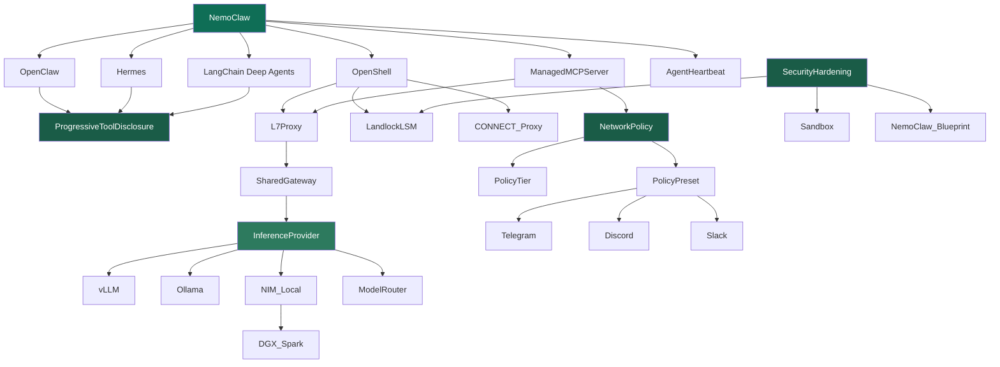

<!-- mcp-name: io.github.Yarmoluk/ckg-nvidia-nemoclaw -->

<div align="center">

# ckg-nvidia-nemoclaw

### NVIDIA NemoClaw as a traversable knowledge graph — MCP-native

**NemoClaw shows you which agent is burning your budget. CKG reduces the burn.**

[](https://pypi.org/project/ckg-nvidia-nemoclaw/)
[](https://pypi.org/project/ckg-nvidia-nemoclaw/)
[](LICENSE)
[](https://github.com/Yarmoluk/ckg-benchmark/blob/main/paper/main.pdf)
[](https://github.com/Yarmoluk/ckg-benchmark/blob/main/paper/main.pdf)
[](https://graphifymd.com)

> *The graph doesn't guess — it traverses. Every answer traces to a declared edge.*

[**PyPI →**](https://pypi.org/project/ckg-nvidia-nemoclaw/) · [**Benchmark →**](https://github.com/Yarmoluk/ckg-benchmark/blob/main/paper/main.pdf) · [**graphifymd.com →**](https://graphifymd.com)

</div>

---

## The graph



---

## What developers are actually hitting

Across GitHub issues, HN threads, and hands-on walkthroughs, three NemoClaw pain signals dominate:

**1. Context bloat in tool loops.** Agents using OpenClaw, Hermes, or LangChain Deep Agents accumulate context across tool calls until the window fills and the session degrades. The bloat isn't the tools — it's that the model re-infers NemoClaw's architecture on every query instead of reading it from a declared structure.

**2. "Which agent is burning my budget?"** Routing inference through OpenShell makes token spend visible per agent for the first time — developers can suddenly see the burn. The next question is how to reduce it.

**3. The Policy Source Gap.** NVIDIA's own OpenShell knowledge graph names this explicitly: `Policy Source Gap` — the missing layer between the runtime policy engine and the structured domain knowledge agents need to make compliant decisions. The graph declares the gap. We filled it.

This package is that layer.

---

## What it is

55 nodes · 74 edges · the full NemoClaw stack as a typed dependency graph. Pre-structured, traversable, deterministic. Served over MCP. No inference at query time — the graph declares relationships that the model traverses instead of infers.

```
Agent asks: "What do I need to deploy a managed MCP server on NemoClaw?"

CKG returns:
  ManagedMCPServer
  ├─ [ENABLES]  NemoClaw               ← platform root
  ├─ [REQUIRES] NetworkPolicy          ← root concept, no dependencies
  └─ [REQUIRES] L7Proxy
       ├─ [IMPLEMENTS] OpenShell
       └─ [REQUIRES]   SharedGateway
            ├─ [ENABLES]     OpenShell
            └─ [IMPLEMENTS]  InferenceProvider

  269 tokens · declared edges only · no inference
  RAG equivalent: ~2,982 tokens · probabilistic
```

```
Agent asks: "What are the three agent runtimes and what do they share?"

  OpenClaw              → [ENABLES] ProgressiveToolDisclosure
  Hermes                → [ENABLES] ProgressiveToolDisclosure
  LangChain_Deep_Agents → [ENABLES] ProgressiveToolDisclosure

  All three implement the same disclosure mechanism.
  A RAG query returns three separate docs. The connection requires inference.
  The graph knows — it's a declared edge.
```

---

## Why zero inference matters for NemoClaw specifically

The dominant community skepticism about NemoClaw: *"even local mode still demands an NVIDIA API key"* — the inference pipeline is cloud-connected regardless of configuration.

CKG runs on **pure Python BFS**. No model. No inference. No API key. No cloud. The graph structure is the answer — the model traverses it, it doesn't generate it. This is what "the graph doesn't guess — it traverses" actually means at the implementation level.

This also makes it suitable for the use cases NemoClaw is specifically designed for: air-gapped deployments, sovereign infrastructure, edge hardware.

---

## The Sandbox Container dependency chain

NemoClaw's sandbox is built to contain the tools your developers already use — the OpenShell CKG declares this explicitly:

```
Sandbox Container
  ├─ [REQUIRES] Gateway
  │    └─ [REQUIRES] OpenShell Runtime
  └─ [REQUIRES] K3s Kubernetes

  [ENABLES] Claude Code
  [ENABLES] OpenCode / Codex
  [ENABLES] GitHub Copilot CLI
  [ENABLES] Cursor
  [ENABLES] Ollama (community)
```

When those agents run inside NemoClaw's blast radius, they need to reason about NemoClaw's architecture — routing, policy tiers, inference providers, security layers. That's exactly what this graph is for.

---

## A/B test — NemoClaw domain, local models, no GPU

We ran 30 real questions drawn from GitHub issues, HN pain points, and the NemoClaw CKG — same questions, same model, with and without CKG injected. CPU only, Ollama, temperature 0.

**Domain category results (excluding control questions):**

| Category | nemotron bare | nemotron + CKG | Lift |
|----------|---------------|----------------|------|
| Lookup | 0.100 | 0.171 | **+71%** |
| Multi-hop | 0.058 | 0.100 | **+73%** |
| Prereq-chain | 0.077 | 0.156 | **+103%** |
| Key-fact accuracy | 9.3% | 22.3% | **+13pp** |

**The bare model doesn't know NemoClaw exists.**

```
Q: What are the three agent runtimes in NemoClaw?

✗ Bare:  "NemoClaw supports TensorFlow, PyTorch, and ONNX Runtime..."
         [invented from general ML knowledge]

✓ CKG:   "OpenClaw (default), Hermes (NEMOCLAW_AGENT=hermes),
          LangChain Deep Agents (NEMOCLAW_AGENT=dcode)"
         [declared edges, correct]
```

```
Q: How does CorporateCA integrate into NemoClaw's security chain?

✗ Bare:  "CorporateCA, a cloud-native IAM solution from NVIDIA, can be
          integrated to enhance security posture..."
         [hallucinated — CorporateCA is not an NVIDIA IAM product]

✓ CKG:   "CorporateCA is anchored at the image build stage for TLS
          interception proxy traversal in NemoClaw."
         [exact mechanism, correct integration point]
```

```
Q: What enterprise manufacturing deployment uses NemoClaw via the FOX Blueprint?

✗ Bare:  "...FOX (Flexible Open-Source Object Tracking) Blueprint..."
         [invented acronym expansion, no mention of Foxconn]

✓ CKG:   "Foxconn's MoMClaw is a production deployment of the FOX Blueprint."
         [correct]
```

**Context window note:** phi4-mini and nemotron-mini truncate at ~2,050 tokens. The NemoClaw CKG is 6,837 tokens — only 30% of the graph is loading. Prereq-chain F1 still doubles on that fraction. Full-context models would widen the gap further.

Full report: `~/projects/ckg-ab-test/results/REPORT_nemoclaw.md`

---

## Install

```bash
pip install ckg-nvidia-nemoclaw
```

## Use as a claude.ai connector (remote, no install)

```
https://ckg-nvidia-nemoclaw.onrender.com/mcp
```

## Use locally — Claude Desktop / Claude Code

```bash
uvx ckg-nvidia-nemoclaw
```

Claude Desktop config:

```json
{
  "mcpServers": {
    "nemoclaw": {
      "command": "uvx",
      "args": ["ckg-nvidia-nemoclaw"]
    }
  }
}
```

---

## Tools

| Tool | Description |
|------|-------------|
| `ask_nemoclaw(question)` | Natural language query — auto-detects concept, traverses the relevant subgraph |
| `query_ckg(concept, depth)` | Typed subgraph around a specific concept (1–5 hops) |
| `get_prerequisites(concept)` | Full upstream prerequisite chain — every dependency in order |
| `search_concepts(query)` | Fuzzy search across all 55 concepts |
| `list_domains()` | Available domains and node/edge counts |

---

## What's in the graph

**55 nodes · 74 edges · 4 edge types: `REQUIRES` · `ENABLES` · `IMPLEMENTS` · `RELATES_TO`**

| Layer | Concepts |
|-------|----------|
| **Agent runtimes** | OpenClaw · Hermes (Nous Research) · LangChain Deep Agents Code |
| **Platform** | OpenShell · NVIDIA Agent Toolkit · OpenShell TUI · CLI |
| **Inference** | inference.local routing · SharedGateway · vLLM · Ollama · Local NIM · ModelRouter |
| **Policy** | NetworkPolicy · PolicyTier (Restricted/Balanced/Open) · PolicyPreset bundles |
| **Security** | L7 proxy · Landlock LSM · CONNECT proxy · Corporate CA · SecurityHardening |
| **Agent features** | Progressive Tool Disclosure · Context Compaction · Agent Heartbeat · Snapshots · Shields |
| **Configuration** | NemoClaw Blueprint · Declarative Multi-Agent Manifest · Managed MCP Servers · Skills · Plugins |
| **Deployment** | Local CLI · Brev CLI · Brev Web UI · DGX Spark · DGX Station · macOS Apple Silicon · WSL2 |
| **Ecosystem** | FOX Blueprint · MoMClaw (Foxconn) · Nemotron 3 Ultra · Agent Harness · LKG Installer |

Every concept maps to a source URL at `docs.nvidia.com/nemoclaw/latest/`. Built from official NemoClaw docs, the FOX Blueprint, and the Nemotron 3 Ultra ecosystem.

---

## Benchmark (v0.6.2 locked)

| System | Macro F1 | Mean tokens | Cost / 1k queries |
|--------|----------|-------------|-------------------|
| CKG | **0.471** | 269 | $7.81 |
| RAG | 0.123 | 2,982 | $76.23 |
| GraphRAG | 0.120 | ~3,000 | ~$76 |

7,928 queries · 5-hop F1: 0.772 (CKG) vs 0.170 (RAG)

Dataset is public: [huggingface.co/datasets/danyarm/ckg-benchmark](https://huggingface.co/datasets/danyarm/ckg-benchmark). Run it yourself.

[Full benchmark paper →](https://github.com/Yarmoluk/ckg-benchmark/blob/main/paper/main.pdf)

---

Built by [Graphify.md](https://graphifymd.com) · [PyPI](https://pypi.org/project/ckg-nvidia-nemoclaw/) · patent pending
