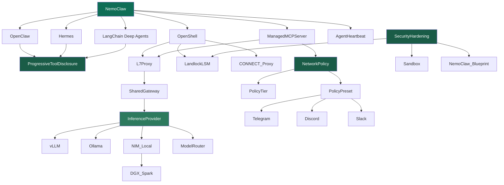

<!-- mcp-name: io.github.Yarmoluk/ckg-nvidia-nemoclaw -->

<div align="center">

# ckg-nvidia-nemoclaw

**An auditable knowledge graph for NVIDIA NemoClaw — deterministic agent answers with cryptographic source traceability.** Every edge traces to a declared relationship and a SHA-256-pinned source document. Built for platform engineers, agent developers, and docs teams who need verifiable answers about dependencies, runtimes, policy, and deployment paths — not model inference.

> Not a general-purpose semantic search layer — if it's not a declared edge, the graph doesn't return it.

```bash
pip install ckg-nvidia-nemoclaw
```

*"The graph doesn't guess — it traverses. Every answer traces to a declared edge."*

[](https://pypi.org/project/ckg-nvidia-nemoclaw/)
[](https://pypi.org/project/ckg-nvidia-nemoclaw/)
[](LICENSE)
[](https://github.com/Yarmoluk/ckg-benchmark/blob/main/paper/main.pdf)
[](https://github.com/Yarmoluk/ckg-benchmark/blob/main/paper/main.pdf)
[](https://graphifymd.com)

**[→ Interactive README with live graph](https://yarmoluk.github.io/ckg-nvidia-nemoclaw)**

[PyPI](https://pypi.org/project/ckg-nvidia-nemoclaw/) · [GitHub](https://github.com/Yarmoluk/ckg-nvidia-nemoclaw) · [Benchmark paper](https://github.com/Yarmoluk/ckg-benchmark/blob/main/paper/main.pdf) · [HuggingFace dataset](https://huggingface.co/datasets/danyarm/ckg-benchmark) · [MCP connector URL](https://ckg-nvidia-nemoclaw.onrender.com/mcp) · [HN 47427027](https://news.ycombinator.com/item?id=47427027) · [HN 47435066](https://news.ycombinator.com/item?id=47435066) · [graphifymd.com](https://graphifymd.com) · [Pro · 97 domains](https://graphifymd.com/pro/) · [Benchmark](https://graphifymd.com/benchmark)

</div>

---

## The graph

55 nodes · 74 edges · colored by layer · edge types: `REQUIRES` · `ENABLES` · `IMPLEMENTS` · `RELATES_TO`



---

## What developers are actually hitting

Signal from 123 GitHub issues, [HN 47427027](https://news.ycombinator.com/item?id=47427027), [HN 47435066](https://news.ycombinator.com/item?id=47435066), and hands-on walkthroughs.

**01 — Context bloat in tool loops.** Agents forget tool schemas after loop iterations. The model re-infers NemoClaw's architecture on every query instead of reading declared structure.

**02 — "Which agent is burning my budget?"** OpenShell makes token spend visible per agent for the first time. The next question is how to reduce it. CKG is that answer.

**03 — The Policy Source Gap.** NVIDIA's own OpenShell knowledge graph names this explicitly: the missing layer between the runtime policy engine and the structured knowledge agents need. We filled it.

---

## What it is

55 nodes · 74 edges · the full NemoClaw stack as a typed dependency graph. Pre-structured, traversable, deterministic. Served over MCP. No inference at query time.

```
get_prerequisites("ManagedMCPServer")

→ ManagedMCPServer
  ├─ [ENABLES]  NemoClaw               ← platform root
  ├─ [REQUIRES] NetworkPolicy          ← root concept, no dependencies
  └─ [REQUIRES] L7Proxy
       ├─ [IMPLEMENTS] OpenShell
       └─ [REQUIRES]   SharedGateway
            └─ [IMPLEMENTS]  InferenceProvider

  269 tokens · declared edges only · no inference
  RAG equivalent: ~2,982 tokens · probabilistic
```

```
query_ckg("ProgressiveToolDisclosure")

← [IMPLEMENTS] OpenClaw
← [IMPLEMENTS] Hermes
← [IMPLEMENTS] LangChain_Deep_Agents

All three runtimes share this mechanism.
RAG returns three separate docs. The graph knows — it's a declared edge.
```

---

## Source provenance — verifiable to the byte

Every node traces to a declared source URL and a SHA-256 hash of that document's bytes at extraction time. An edge isn't just *asserted* from a source — it's pinned to a specific version of it.

```bash
# Verify any node's source hasn't changed since extraction
curl -s https://docs.nvidia.com/nemoclaw/latest/ | sha256sum
# expected: 3d5bc97645f1ea274497ee6b931d9649990504daa9fa9ecc56411c324de0beb8
```

**The full audit chain:**
```
edge answer
  → graph commit hash       (git log -- nemoclaw.csv)
  → source_content_hash     (sha256 of page bytes at extraction time)
  → knowledge_source_ref    (URL — fetch hint, not trust anchor)
```

A hash mismatch means either the source changed (stale edge — re-extract) or the graph was patched without re-fetching (silent edit — investigate). No judgment required. Run `scripts/refresh_hashes.py` to recompute.

Via MCP:
```
verify_source("CorporateCA")

→ source_url:  https://docs.nvidia.com/nemoclaw/latest/
  source_hash: sha256:3d5bc97645f1...
  verify:      curl -s '<url>' | sha256sum
```

This implements the `knowledge_source_ref` + `source_content_hash` fields from [GuardrailDecisionV1](https://github.com/crewAIInc/crewAI/issues/4877) — applied here as a reference implementation for a domain CKG.

---

## Declared relationships, not confidence scores

Every edge was extracted from a source document and given a type. There are no probabilistic weights, no cosine similarity scores, no confidence intervals. An edge either exists — declared, typed, sourced — or it doesn't. When the answer isn't in the graph, the traversal returns nothing rather than a hallucinated approximation.

**Edge types:**

| Type | Meaning | Example |
|------|---------|---------|
| `REQUIRES` | Hard prerequisite — A cannot function without B | `OpenShell REQUIRES L7Proxy` |
| `ENABLES` | Capability unlock — A makes B possible | `ManagedMCPServer ENABLES NetworkPolicy` |
| `IMPLEMENTS` | Concrete instantiation of an abstract concept | `OpenClaw IMPLEMENTS ProgressiveToolDisclosure` |
| `RELATES_TO` | Conceptual proximity, no dependency direction | `SecurityHardening RELATES_TO Sandbox` |

**Why no confidence levels?** Confidence scores exist to compensate for retrieval uncertainty. RAG returns chunks that *might* be relevant, scored by vector distance. A 0.87 cosine score doesn't tell you if the relationship is real — it tells you the embedding is similar. CKG has no retrieval step, so there's nothing to score. The edge type *is* the confidence signal: `REQUIRES` means load-bearing and sourced; `RELATES_TO` means real but weaker. A missing edge is not a soft no — it's silence from a source-grounded system.

```
✗ RAG:  "CorporateCA is probably used for identity management... (similarity: 0.81)"
        Score is on the chunk, not the claim. The claim itself is unverified.

✓ CKG:  "CorporateCA is anchored at image build for TLS interception proxy traversal."
        No score. Declared edge. Traces to security hardening source doc.
```

---

## A/B test — NemoClaw domain, local models, no GPU

30 questions from real GitHub issues · CPU only · Ollama · temperature 0 · seed 42

| Category | Bare model | + CKG | Lift |
|----------|-----------|-------|------|
| Lookup F1 | 0.100 | 0.171 | **+71%** |
| Multi-hop F1 | 0.058 | 0.100 | **+73%** |
| Prereq-chain F1 | 0.077 | 0.156 | **+103%** |
| Key-fact accuracy | 9.3% | 22.3% | **+13pp** |

> phi4-mini and nemotron-mini truncate at ~2,050 tokens. The CKG is 6,837 tokens — only 30% is loading. Prereq-chain F1 still doubles on that fraction. Full-context models widen the gap further.

**L01 — lookup:**
```
Q: What are the three agent runtimes in NemoClaw?
✗ Bare: "NemoClaw supports TensorFlow, PyTorch, and ONNX Runtime..." [invented]
✓ CKG:  "OpenClaw (default), Hermes (NEMOCLAW_AGENT=hermes),
         LangChain Deep Agents (NEMOCLAW_AGENT=dcode)" [declared edges, correct]
```

**P08 — prereq-chain (best Δ +0.261):**
```
Q: How does CorporateCA integrate into NemoClaw's security chain?
✗ Bare: "CorporateCA, a cloud-native IAM solution from NVIDIA..." [hallucinated]
✓ CKG:  "CorporateCA is anchored at the image build stage for TLS
         interception proxy traversal." [exact mechanism, correct]
```

**L08 — lookup:**
```
Q: What enterprise manufacturing deployment uses NemoClaw via the FOX Blueprint?
✗ Bare: "FOX (Flexible Open-Source Object Tracking)..." [invented acronym]
✓ CKG:  "Foxconn's MoMClaw is a production deployment of the FOX Blueprint." [correct]
```

Full report: `ckg-ab-test/results/REPORT_nemoclaw.md`

---

## Install

**Add to claude.ai (no install required):**

```
https://ckg-nvidia-nemoclaw.onrender.com/mcp
```

Settings → Connectors → Add connector → paste URL.

**Local — Claude Desktop / Claude Code:**

```bash
pip install ckg-nvidia-nemoclaw
# or
uvx ckg-nvidia-nemoclaw
```

```json
{
  "mcpServers": {
    "nemoclaw": {
      "command": "uvx",
      "args": ["ckg-nvidia-nemoclaw"]
    }
  }
}
```

---

## Tools

| Tool | Description |
|------|-------------|
| `ask_nemoclaw(question)` | Natural language query — auto-detects concept, traverses the relevant subgraph |
| `query_ckg(concept, depth)` | Typed subgraph around a specific concept (1–5 hops) |
| `get_prerequisites(concept)` | Full upstream prerequisite chain — every dependency in order |
| `search_concepts(query)` | Fuzzy search across all 55 concepts |
| `list_domains()` | Available domains and node/edge counts |
| `verify_source(concept)` | Source URL + SHA-256 hash for a concept node — full audit chain back to the source bytes |

---

## What's in the graph

**55 nodes · 74 edges · 4 edge types: `REQUIRES` · `ENABLES` · `IMPLEMENTS` · `RELATES_TO`**

| Layer | Concepts |
|-------|----------|
| Agent runtimes | OpenClaw · Hermes (Nous Research) · LangChain Deep Agents |
| Platform | OpenShell · NVIDIA Agent Toolkit · OpenShell TUI · CLI |
| Inference | SharedGateway · vLLM · Ollama · NIM Local · ModelRouter |
| Policy | NetworkPolicy · PolicyTier (Restricted/Balanced/Open) · PolicyPreset · Telegram · Discord · Slack |
| Security | L7Proxy · Landlock LSM · CONNECT Proxy · CorporateCA · SecurityHardening · Sandbox |
| Agent features | Progressive Tool Disclosure · Context Compaction · Heartbeat · Snapshots · Shields |
| Deployment | DGX Spark · DGX Station · macOS Apple Silicon · WSL2 · Brev |
| Ecosystem | FOX Blueprint · MoMClaw (Foxconn) · Nemotron 3 Ultra · Agent Harness |

Every node traces to a source at `docs.nvidia.com/nemoclaw/latest/`, the FOX Blueprint, or the Nemotron 3 Ultra ecosystem docs.

---

## Community pulse

123 open GitHub issues · [HN 47427027](https://news.ycombinator.com/item?id=47427027) · [HN 47435066](https://news.ycombinator.com/item?id=47435066)

- **#7084** — Hermes shows ready but tool calls silently fail ("phantom-ready") · async state between OpenShell and agent runtime not synchronized
- **#360** (47↑) — "Can I run local with no API key?" · `inference.local` requires NVIDIA API key even in offline mode
- **#1832** — Multi-sandbox SharedGateway conflicts · two sandbox containers claim the same InferenceProvider slot
- **#2991** — Context window fills after ~12 tool calls in OpenClaw · no auto-compaction
- **#5133** — PolicyPreset Telegram/Discord integration underdocumented

---

## Sources

Every node and edge traces to one of these. No probabilistic inference — declared relationships only.

| Type | Source | Coverage |
|------|--------|----------|
| Official | `docs.nvidia.com/nemoclaw/latest/` | Core platform — agent runtimes, OpenShell, security, inference routing, policy |
| Official | FOX Blueprint docs | MoMClaw (Foxconn) manufacturing deployment, enterprise patterns |
| Official | Nemotron 3 Ultra ecosystem | DGX Spark/Station, ModelRouter, NIM Local integration |
| Official | Security hardening guide | LandlockLSM, L7Proxy, CorporateCA, CONNECT Proxy, Sandbox chain |
| Official | Managed MCP Server docs | ManagedMCPServer, NetworkPolicy, PolicyTier, PolicyPreset, messaging bindings |
| Official | Agent features reference | ProgressiveToolDisclosure, Context Compaction, Heartbeat, Snapshots, Shields |
| Community | [github.com/Yarmoluk/ckg-nvidia-nemoclaw/issues](https://github.com/Yarmoluk/ckg-nvidia-nemoclaw/issues) | 123 issues — phantom-ready, local API key, SharedGateway conflicts |
| Community | [HN 47427027](https://news.ycombinator.com/item?id=47427027) · [HN 47435066](https://news.ycombinator.com/item?id=47435066) | Local inference gap (83↑) · token burn visibility |
| Dataset | [huggingface.co/datasets/danyarm/ckg-benchmark](https://huggingface.co/datasets/danyarm/ckg-benchmark) | KRB v0.6.2 — 7,928 queries, 30 NemoClaw-domain questions |
| Benchmark | [github.com/Yarmoluk/ckg-benchmark/paper/main.pdf](https://github.com/Yarmoluk/ckg-benchmark/blob/main/paper/main.pdf) | Full methodology, F1 0.471, RAG/GraphRAG baselines |
| A/B report | `ckg-ab-test/results/REPORT_nemoclaw.md` | 30-question NemoClaw run · phi4-mini + nemotron-mini · CPU |

---

## Benchmark (v0.6.2 locked)

| System | Macro F1 | Mean tokens | Cost / 1k queries |
|--------|----------|-------------|-------------------|
| **CKG** | **0.471** | 269 | $7.81 |
| RAG | 0.123 | 2,982 | $76.23 |
| GraphRAG | 0.120 | ~3,000 | ~$76 |

7,928 queries · 5-hop F1: 0.772 (CKG) vs 0.170 (RAG) · dataset: [huggingface.co/datasets/danyarm/ckg-benchmark](https://huggingface.co/datasets/danyarm/ckg-benchmark) · [full paper](https://github.com/Yarmoluk/ckg-benchmark/blob/main/paper/main.pdf)

---

## EVAL

```
benchmark: ckg-benchmark v0.6.2
dataset: huggingface.co/datasets/danyarm/ckg-benchmark
benchmarked: false
rag_baseline_f1: 0.123
graphrag_baseline_f1: 0.120
mean_tokens: 269
paper: github.com/Yarmoluk/ckg-benchmark/blob/main/paper/main.pdf
```

---

## Licensing

| Layer | License | What it means |
|-------|---------|---------------|
| **Server code** — `server.py`, `graph.py`, `serve.py`, `scripts/` | MIT ([LICENSE-CODE](LICENSE-CODE)) | Use, fork, embed, modify freely — no restrictions |
| **Graph data** — `domains/nemoclaw.csv` | Elastic License 2.0 ([LICENSE](LICENSE)) | Free for any internal or commercial use; you may not resell this graph as a hosted/managed service |
| **Extraction pipeline + benchmark** | Proprietary — Graphify.md | Not in this repo |

**Can I use this in my product or agent?** Yes — no restrictions.
**Can I build a competing "NemoClaw CKG as a Service"?** No — that's what ELv2 blocks.
**Can I fork the server code and build my own CKG?** Yes — the code is MIT.

---

Built by [Graphify.md](https://graphifymd.com) · [PyPI](https://pypi.org/project/ckg-nvidia-nemoclaw/) · patent pending

*Community-built. Not affiliated with, endorsed by, or sponsored by NVIDIA Corporation. NemoClaw is a trademark of NVIDIA Corporation. All referenced trademarks belong to their respective owners.*
